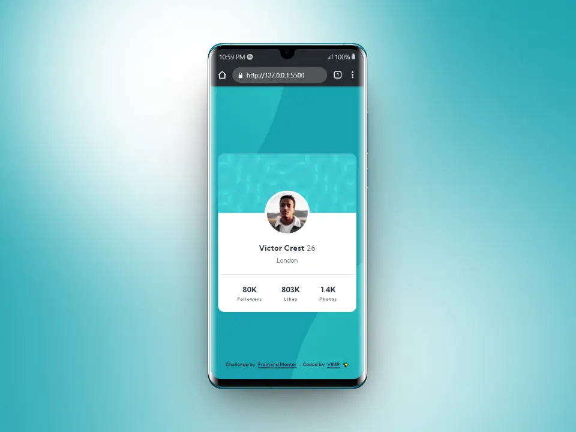

# Frontend Mentor - Profile card component solution

This is a solution to the [Profile card component challenge on Frontend Mentor](https://www.frontendmentor.io/challenges/profile-card-component-cfArpWshJ).

Frontend Mentor challenges help you improve your coding skills by building realistic projects. 

## Table of contents

- [The challenge](#the-challenge)
- [Screenshot](#screenshot)
- [Link](#link)
- [Built with](#built-with)
- [Author](#author)

## The challenge

📌 Build out the project to the designs provided

## Screenshot

### 📱 Mobile

### 💻 Desktop

## Link

[Live](https://mendez-v.github.io/profile-card-component/) 👀

## Built with

🎯 Semantic HTML5 markup

🎯 CSS custom properties

🎯 Flexbox

🎯 CSS Grid

🎯 Mobile-first workflow

## Author

✨ Frontend Mentor - [@mendez-v](https://www.frontendmentor.io/profile/mendez-v)
